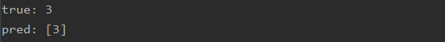

Сервис предназначен для предcказания класса по датасету cifar10

основной: модуль main.py

модель: пакет app

пример получения предсказания сервиса: get_prediction.py

первоначальный эксперимент: model_train.py

classification report:

prediction example:

Docker

для создания docker image используется Dockerfile

<xml>

    создание docker image 
    $ docker build -t YOUR_IMAGE_NAME .
    
</xml> 

<xml>

    сборка контейнера из образа из запуск Сервиса
    $ docker run -it -p 8080:80 YOUR_IMAGE_NAME
    $ python3 main.py 
    или
    $ docker run -it -p 8080:80 -e FLASK_APP=main.py -e FLASK_DEBUG=1 YOUR_IMAGE_NAME flask run --host=0.0.0.0 --port=8080
    
</xml>

подключение к контейнеру и запуск скрипта предсказания модели на одном примере

<xml>

    просмотр активных контейнеров
    $ docker ps
    запуск скрипта get_prediction.py
    $ docker exec -t YOUR_CONTAINER_ID python3 get_prediction.py --predict
    
</xml>

полезные команды

<xml>

    просмотр всех контейнеров
    $ docker ps -a
    просмотр последнего созданного контейнера
    $ docker ps -l
    удаление контейнера
    $ docker rm YOUR_CONTAINER_ID
    старт контейнера
    $ docker start YOUR_CONTAINER_ID
    остановка контейнера
    $ docker stop YOUR_CONTAINER_ID
    просмотр всех образов
    $ docker images -a
    удаление образа
    $ docker rmi YOUR_IMAGE_ID
    войти в контейнер в интрактивном режиме
    $ docker exec -it YOUR_CONTAINER_ID bin/bash 
    выход из контейнера
    $ exit
    копирование файлов в контейнер
    $ docker cp FILENAME YOUR_CONTAINER_ID:FILENAME
    создание образа из измененного контейнера
    $ docker commit -m "some text to commit" -a "maintainer name" YOUR_CONTAINER_ID NEW_IMAGE_NAME
    поиск образов
    $ docker search tensorflow
    скачать образ
    $ docker pull tensorflow/tensorflow
    
    
</xml>

author: Danilchenko Vadim

email: vndanilchenko@gmail.com